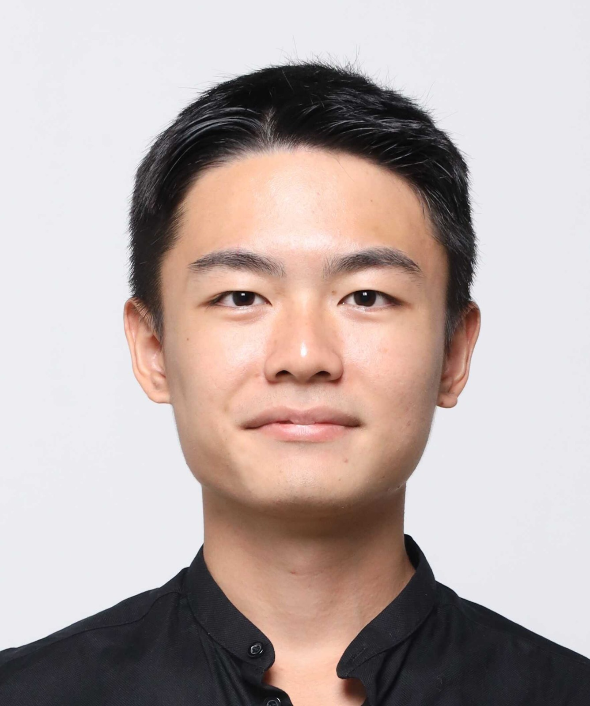
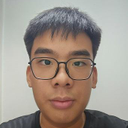

We are a team based in the [School of Computing, National University of Singapore](https://www.comp.nus.edu.sg).

You can reach us at the email `seer[at]comp.nus.edu.sg`

## Project team

### John Doe

[[homepage](http://www.comp.nus.edu.sg/~damithch)]
[[github](https://github.com/johndoe)]
[[portfolio](team/johndoe.md)]

* Role: Project Advisor

### Neo Ryan "ryrybn"

[[github](http://github.com/ryrybn)]
[[portfolio](team/ryrybn.md)]

* Role: Architect
* Responsibilities: Integration

### Damian

[[github](http://github.com/damianngwz.md)] [[portfolio](team/damianngwz.md)]

* Role: Team Lead
* Responsibilities: Responsible for overall project coordination.

### Jean Doe

[[github](http://github.com/zenercurrent)]
[[portfolio](team/zenercurrent.md)]

* Role: Developer
* Responsibilities: Testing

### Rui Sheng

[[github](http://github.com/Arrus218)]
[[portfolio](team/arrus218.md)]

* Role: Scheduling and tracking
